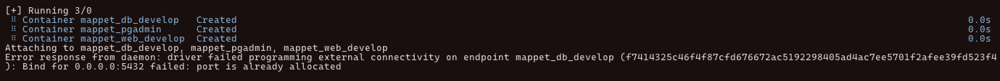

# CAR ARQUITECTURA PRUEBA TÉCNICA

<br/>

`Technical test for the CAR ARQUITECTURA`

<br/>

# Run Project

## Build Project

```
sudo docker-compose build
```

## Start Project

```
sudo docker-compose up
```

`wait until start`

<br/>

# Create a SuperUser

`To create a superuser, you need to open a new terminal window and run the following command:`

```
sudo docker-compose run web python manage.py createsuperuser
```

`fill all the fields and press enter.`

<br/>

# Open Admin Panel

Open <a href="http://localhost:8000">Admin Panel</a> and fill in the username and password, then press enter.

<br/>
<br/>

# Posible Issues

## PostgreSQL:

<br/>

`When you try to start the project, you may encounter this error:`



` This is happening because port 5432 is being used by another container or local postgres installation.`

`To solve this error, check if the problem comes because a container is already using that port or it is the postgres local installation.`

<br/>

## Check Container

<hr/>

`To check if another container is already using the port:`

```
sudo docker ps
```

`If you have active containers, it will show you something like this:`


`Look for some to have 5432 in the port.`

`if you find one, then copy the container id and run the following command:`

```
sudo docker kill <container id>
```

`also you can stop all the containers:`

```
sudo docker kill $(sudo docker ps -q)
```

<br/>

## Postgres Local Installation

<hr/>

`Stop Postgres in local:`

<a href="https://stackoverflow.com/questions/34173451/stop-postgresql-service-on-mac-via-terminal">MacOs</a>

<a href ="https://stackoverflow.com/questions/41528530/stopping-postgresql-from-starting-on-ubuntu-startup">Linux</a>

<a href ="https://serverfault.com/questions/311565/stop-postgresql-from-starting-on-windows">Windows</a>
